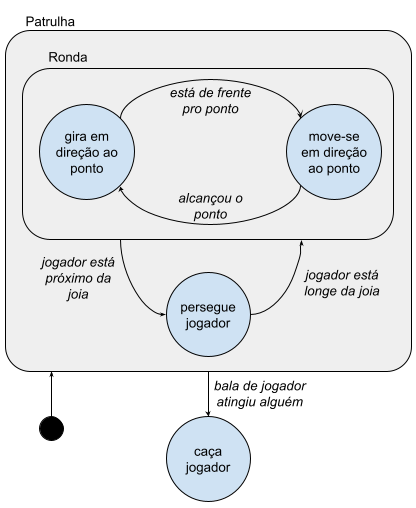

# Exemplo de implementação de uma Árvore de Comportamento

Este código tem como objetivo ilustrar uma forma de implementar uma árvore de comportamento.

Para testar, basta carregar o arquivo `index.html` em um servidor (por exemplo, no live-server no vscode).

